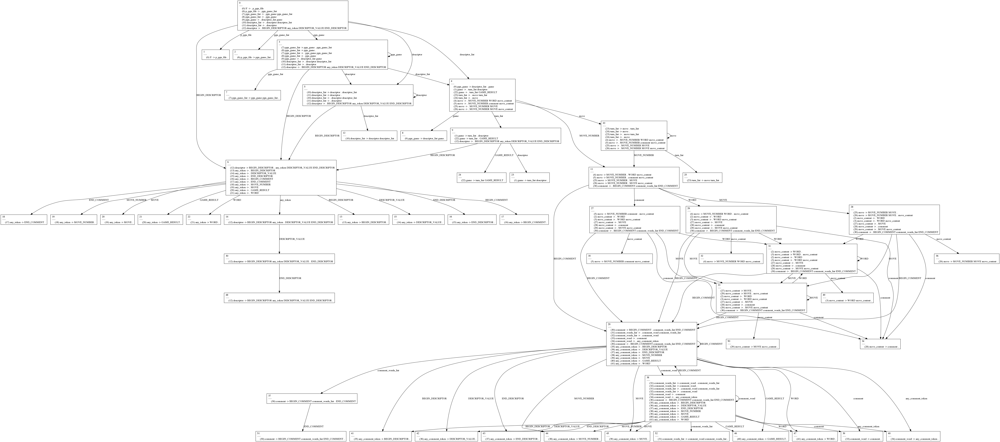

#### Notas
Este es un borrador para ir poniendo las ideas del informe

A presentar:

* Una descripción de:
  - La solución adoptada
  - El método utilizado
  - Decisiones tomadas
  - Tipo de gramática y/o parser
* Código (hecho) con comentarios (no hecho)
* Ejemplos de corrida con entradas y salidas acorde (hay ejemplos pero no esta documentado)
* Conclusiones:
  - Dificultades encontradas
  - Relevancia de los temas vistos en la materia
  - Eficiencia
  - Posibilidades adicionales
  - Descripción técnica sobre los problemas específicos que encontramos

# Presentación

Este trabajo práctico implementa un parser básico para una versión extendida
del formato `PGN` en la cuál los comentarios se pueden anidar arbitrariamente y
los descriptores de evento son cadenas arbitrarias.

El informe documenta el proceso de diseño e implementación del trabajo así cómo
rutas alternativas que no decidimos explorar.

# Diseño e implementación

El diseño del trabajo práctico se separó en partes distinguidas: primero
conseguir una gramática básica razonable y luego implementar los procesos
propuestos por la materia. Para esto el uso de PLY como parser generator
simplificó gratamente el proceso.

## Lexer

Si bien el lexer y el parser se desarrollaron en conjunto el enfoque fué en
tener a éste terminado primero. Dado que un conjunto de tokens suficientemente
expresivo y estable nos permitió iterar con las reglas del parser mucho más
fácilmente.

Los tokens nuestro lexer genera son los siguientes:

* `BEGIN_DESCRIPTOR`: El inicio de un descriptor, siempre es la cadena "["
* `DESCRIPTOR_VALUE`: Una cadena de texto arbitrario (excepto el caracter para
  comillas dobles) entre comillas dobles
* `END_DESCRIPTOR`: El fin de un descriptor, siempre es la cadena "]"
* `BEGIN_COMMENT`: El inicio de un comentario, siempre es la cadena "{"
* `END_COMMENT`: El fin de un comentario, siempre es la cadena "}"
* `MOVE_NUMBER`: Un número válido para un movimiento, cómo "1..." o "2."
* `MOVE`: Un movimiento válido
* `GAME_RESULT`: El resultado de una partida
* `WORD` : Cualquier otra cadena sin espacios en el medio

Una cosa a notar es que nuestro lexer aprovecha el que el motor de expresiones
regulares permite priorizar opciones ordenándolas (por ejemplo `/a|aa/` nunca
matchea `aa`). Utilizamos esto para tener una buena definición de `WORD`. Otra
cosa notable es que podríamos haber armado a los descriptores como un único
token (algo parecido a `/\[([^" \t]+)[ \t]*"([^"]*)"\]/) pero dado que
decidimos "congelar" el desarrollo del lexer ni bien sentíamos que alcanzaba
para nuestras necesidades nos quedamos con un poco de complejidad extra.

La existencia del token `WORD` es para poder tokenizar el texto arbitrario
dentro de comentarios. Una alternativa es la de "island grammars" propuesta por
ANTLR o el uso de start conditions presentes en PLY.

## Parser

El el desarrollo del parser fué principalmente top-down. Comenzando por la
regla `pgn_file` fuimos describiendo la forma del archivo (un archivo pgn es
una lista de partidas, que son un encabezado y un cuerpo, un encabezado es una
lista de descriptores...). Dos cosas a puntualizar son el que tenemos muchas
reglas con la forma `lista_de_cosas -> cosa lista_de_cosas | cosa` y que para
el manejo de algunos errores construimos reglas que producen la terminación del
programa al reducir.

La lista de reglas definidas es la siguiente:

* `pgn_file`: Un fichero `pgn` el símbolo inicial de nuestra gramática
* `pgn_game_list`: Una lista de partidos
* `pgn_game`: Un partido, compuesto por si header y la descripción propia del
  partido
* `descriptor_list`: El encabezado del archivo, una lista de descriptores
* `descriptor`: Una etiqueta específica de un archivo
* `any_token`: El nombre de una etiqueta. Está conformado de todos los tokens
  posibles dado que quisimos permitir movimientos o cadenas como nombres
válidos
* `game`: Las jugadas que conforman a un partido seguidas de su resultado
* `turn_list`: Una lista de jugadas
* `move`: Una jugada en específico, posee al menos un movimiento de pieza
* `move_content`: Una secuencia de comentarios y movimientos de piezas que
  corresponden a una jugada
* `comment`: Un comentario
* `comment_words_list`: La lista de palabras, jugadas y subcomentarios que
  conforman a un comentario
* `comment_word`: Un elemento de un comentario (un comentario o una palabra)`
* `any_comment_token`: Una palabra de un comentario

# Problemas encontrados

En esta sección detallamos los problemas encontrados y los distintos
acercamientos a sus soluciones.

## Manejo de errores

El manejo de errores en EOF resultó tremendamente difícil. Si bien
conceptualmente es fácil describir "error de comment no cerrado ocurre cuando
se puede reducir `BEGIN_COMMENT comment_words_list eof`" esto no tiene un mapeo
simple al parser generator. Para el reporte de errores PLY ofrece el
pseudo-símbolo `error` pero por alguna razón un error al final de un archivo no
se reduce a este símbolo (o al menos no encontramos cómo lograrlo) para poder
imprimir el mensaje de error que deseábamos.

Para manejar casos de error específicos cómo movimientos inválidos o
comentarios ubicados en lugares incorrectos escribimos producciones que generan
error al reducir. Éstas resultan fáciles de construir y mantener, pero
acomplejizan el autómata y empeoran el manejo genérico de errores.

Para imprimir mejores mensajes de error en casos genéricos directamente
escribimos un manejador de errores que imprime las transiciones válidas del
autómata en el momento en el cuál se produjo el error. Esto puede ser un tanto
confuso para un usuario pero resulta muy útil a la hora de debuggear. Al tener
producciones que reducen a un error resulta falso que todas las transiciones
"legales" "reducen bien". Si bien decidimos mantener ambos acercamientos al
reporte de errores en nuestro proyecto creemos que esta incompatibilidad no es
irresoluble, dado que las producciones de error podrían ser marcadas como tales
y ser modificado el autómata para saber si un estado posee sólamente
producciones de error en su conjunto de ítems.

## Visualización del autómata

PLY ofrece un archivo `parser.out` con un detalle sobre el parser generado.
Para poder diagnosticar varios de nuestros problemas y entender mejor el código
generado creamos un par de scripts que transforman éste en un diagrama
utilizando AWK y Graphviz.

# Conclusiones

Los generadores de parsers son una herramienta muy fácil de utilizar para
gramáticas simples, pero entenderlos en profundidad, diagnosticar errores y
realizar adaptaciones complejas requiren de un entendimiento de la algoritmia
detrás de ellos. El manejo de errores es una tarea muy dificultosa de realizar
sin modificar en gran medida la gramática "deseada".
